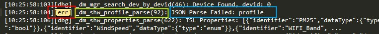
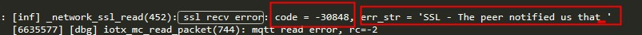
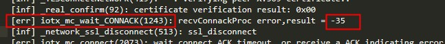
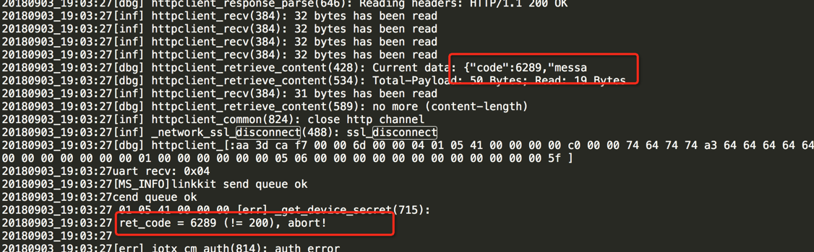

# 日志排查
 - 定位错误信息
    * 大部错误日志都会有个err开头的前缀，如图。 
    
        * 红色是前缀
        * 黄色是错误所在的函数
        * 蓝色是错误内容
    * 有了这些内容我们就可以知道代码出在哪里，是哪个模块的代码出现问题了。
    * alios-things和linkkit都是开源的，能力强点的同学可以自己调试代码，找到问题所在（bug或者代码逻辑的问题）。
    
 - 错误分类
    * 连接错误 大多都伴随着"ssl_disconnect",在这个日志前后基本能找到错误信息
        * ssl错误
          
          code是错误码，ssl通用的。这里看到的是-30848，然后用计算器转换成16进制可以得到-0x7880。可以在源码或者网络上查到对应的错误信息。
          mbedtls/ssl.h中可查到
          
          `#define MBEDTLS_ERR_SSL_PEER_CLOSE_NOTIFY                 -0x7880  /**< The peer notified us that the connection is going to be closed. */`
        * mqtt错误
          
          iot_export_errno.h（路径肯能随着版本的不同儿不同，可能搜索'MQTT_CONNACK_BAD_USERDATA_ERROR'能快速定位到文件）中可以查到图中的错误码。
        * 请求错误
          
          图中的code就是错误代码。
          [code列表](https://living.aliyun.com/doc#rrgyp4.html)
          